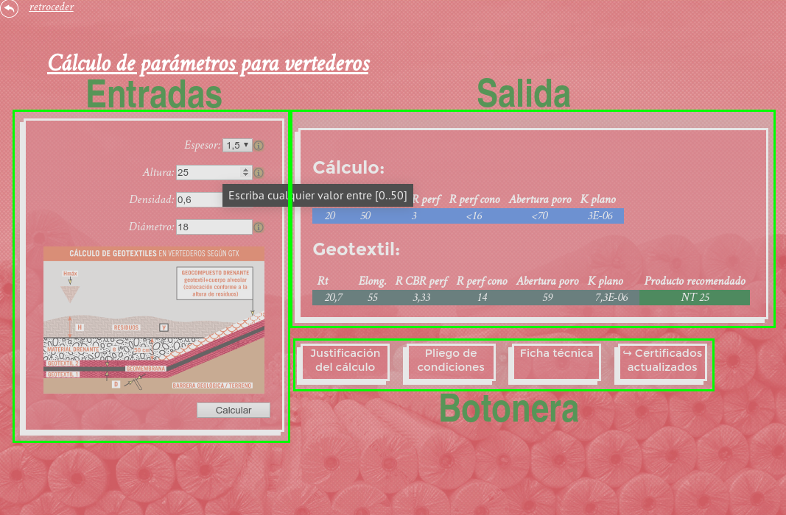

---

# INSTRUCCIONES

Para lanzar la aplicación abra el fichero [`index.html`](index.html).

Navegue por las diferentes secciones haciendo clic. Vuelva al menú principal con «retroceder» (arriba a la izquierda).

   

## Cálculos

Los formularios de cálculo constan de tres secciones:

### Parámetros de entrada

Introduzca los valores según el tipo de cálculo. Si deja el puntero sobre el campo, se mostrará el rango permitido.
> Si el campo no es numérico o solo admite ciertos valores, se seleccionará mediante un desplegable.

El significado de cada parámetro se puede ver en el diagrama inferior. Para ampliar el diagrama pulse en el icono ℹ que hay junto a cada campo de entrada.

Una vez establecidas las entradas, para ver el resultado del cálculo haga clic en el botón «Calcular».

### Valores de salida

El resultado del cálculo se divide en dos:

1. **Cálculo**: Valores calculados que debe cumplir el geotextil a aplicar.

2. **Geotextil**: Producto recomendado por Geotexan, junto a los valores característicos de calidad del mismo.

### Botonera

Teniendo el resultado en pantalla, se puede imprimir:

* Justificación del cálculo

* Pliego de condiciones

* Ficha técnica del producto recomendado

El botón «Certificados actualizados» abrirá, en una nueva pestaña, los certificados de calidad más recientes de la web de Geotexan. _Requiere conexión a Internet._
